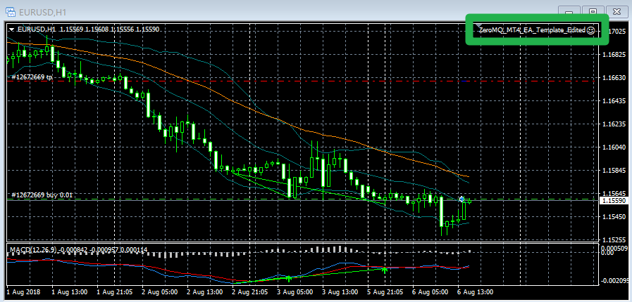
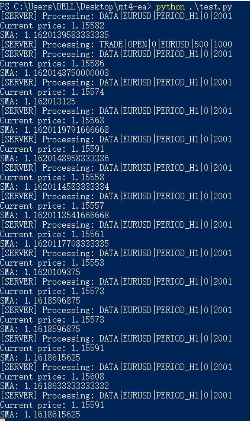

# py-mt4
用Python来写MT4的自动化交易脚本 🎉

# 原理
- 使用MQL4原生库调用ZERO-MQ作为消息服务端
- 使用其它语言，如Python作为客户端调用接口

# 机器环境
- win10
- python3.5

# 安装教程
- 克隆代码下来
- 关闭杀毒软件！！！
- 解压MT4配置文件.rar
- 把Include的东西放到MT4的Include文件夹下
- 把Library/X86/的东西放到MT4的Library文件夹下
- 把ZeroMQ_MT4_EA_Template_Edited.mq4放到MT4的Experts文件夹下
- pip install pyzmq
- pip install TA_Lib-0.4.17-cp35-cp35m-win_amd64.whl  (版本可以在这里下载：https://www.lfd.uci.edu/~gohlke/pythonlibs/)

# 启动EA脚本
- 打开MT4，在左下方把ZeroMQ_MT4_EA_Template_Edited.mq4托入想交易的图形中， 并允许EA添加外部DLL和自动交易
- 右上角会有个哭脸，说明没启动
- 点击【自动交易】，哭脸变笑脸则启动成功
- 修改和运行自动化EA脚本.py进行测试

# 效果

